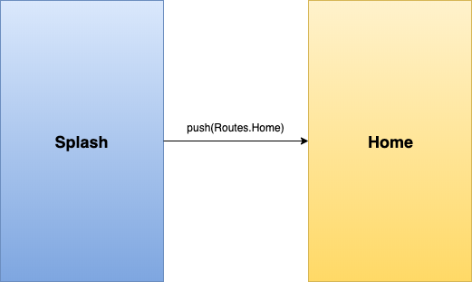
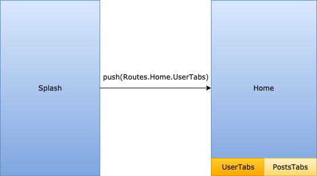

# Navigator

Android Multi-module navigator, trying to find a way to navigate into a modularized android multi module project

# Import

```groovy
implementation "com.github.florent37:navigator:1.0.0"
```

# Multi module sample

```
project
  |
  \--app
  |
  \--routing
  |
  \--splash
  |
  \--home
  |
  \--user
```

And we want the next screen flow
```
app --[directly starts]--> Splash --> Home --[clicks on an user]--> User(id) 
```

- `splash` should only know `routing`
- `home` should only know `routing`
- `user` should only know `routing`
- `app` should only know `routing` to present the splash
- `routing` should not know others modules

# Define routes 

In a dedicated module, created shared routes into a `Route` object

in module `routing` :
```kotlin
object Routes {

    object Splash : Route("/")
    
    object Home : Route("/home")
    
    object User : RouteWithParams<UserParams>("/user/{userId}") {
        class UserParams(val userId: String) : Param
    }
}
```

# Bind routes

You need to associate an intent to each `Route` in your feature's module

in module `splash` :
```kotlin
Routes.Splash.register { context ->
     Intent(context, SplashActivity::class.java)
}
```

If you want an android module to register automatically its route, 
you can bind using [applicationprovider's auto providers](https://github.com/florent37/ApplicationProvider) :

```kotlin
//automatically launched after application's onCreate()
class RouteProvider : Provider() {
    override fun provide() {
        Routes.Splash.register { context ->
            Intent(context, SplashActivity::class.java)
        }
    }
}
```

then declare it in your module's AndroidManifest.xml

```xml
<provider
      android:authorities="${applicationId}.splash.RouteProvider"
      android:name=".RouteProvider"/>
```

# Navigation

## Push

You can push a route from an activity (or fragment) using 

```kotlin
Navigator.of(this).push(Routes.Home)
```

or by its path

```kotlin
Navigator.of(this).push("/home/")
```




You can also change the route from anywhere (eg: an android ViewModel) using `Navigator.current()`

```kotlin
Navigator.current()?.push(Routes.Home)
```

## A route with parameters

Navigating to a route with parameters forces to specify values
```kotlin
Navigator.of(this).push(Routes.User, UserParams(userId= "3"))
```

You can retrieve them using kotlin's delegated properties

```kotlin
class UserActivity : Activity {
    private val args by parameter<Routes.User.Params>()
    
    override fun onCreate(savedInstanceState: Bundle?) {
        super.onCreate(savedInstanceState)
    
        val userId = args.userId
```

You can also call it by path's params
```kotlin
Navigator.of(this).push("/user/3")
```

It will use [moshi](https://github.com/square/moshi) to create the parameter from path params

## Pop

```kotlin
Navigator.of(this).pop()
```

## PushReplacement

If you want to replace the current screen

```kotlin
Navigator.current()?.pushReplacement(Routes.Splash)
```

# Route Flavors

A flavor is an endpoint of a route, you can use them to navigate to an Activity's BottomNavigation item

```kotlin
object Home : Route("/home/") {
     object UserTabs : Flavor<Home>(this,"home/tabUsers")

     object PostsTabs : FlavorWithParams<Home, PostsTabs.Params>(this,"home/tabPosts") {
         class Params(val userId: Int?) : Parameter()
     }
}
```

You can push this like a route

```kotlin
Navigator.current()?.push(Routes.Home.UserTabs)
```



And bind this into your Activity

```kotlin
class HomeActivity : AppCompatActivity(R.layout.activity_home) {

    override fun onCreate(savedInstanceState: Bundle?) {
        super.onCreate(savedInstanceState)

        viewPager.adapter = ViewPagerAdapter(
            supportFragmentManager
        )

        bottomNav.setupWithViewPager(viewPager)

        bindFlavor(Routes.Home.UserTabs, intent)
            .withBottomNav(bottomNav, R.id.tabUsers)

        bindFlavor(Routes.Home.PostsTabs, intent)
            .withBottomNav(bottomNav, R.id.tabPosts)

    }
}
```

And to retrieve a flavor parameter

```kotlin
class PostsFragment : Fragment {
    private var args by optionalFlavorParameter<Routes.Home.PostsTabs.Params>()
    
    override fun onViewCreated(view: View, savedInstanceState: Bundle?) {
        super.onViewCreated(view, savedInstanceState)

        val userId = args.userId
```

# Credits

Author: Florent Champigny [http://www.florentchampigny.com/](http://www.florentchampigny.com/)


License
--------

    Copyright 2019 Florent37, Inc.

    Licensed under the Apache License, Version 2.0 (the "License");
    you may not use this file except in compliance with the License.
    You may obtain a copy of the License at

       http://www.apache.org/licenses/LICENSE-2.0

    Unless required by applicable law or agreed to in writing, software
    distributed under the License is distributed on an "AS IS" BASIS,
    WITHOUT WARRANTIES OR CONDITIONS OF ANY KIND, either express or implied.
    See the License for the specific language governing permissions and
    limitations under the License.
